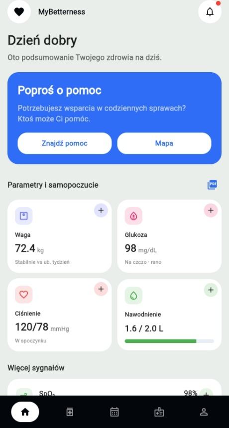
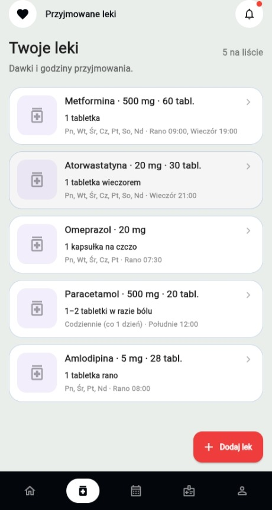
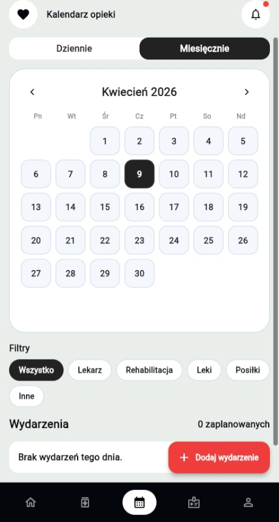
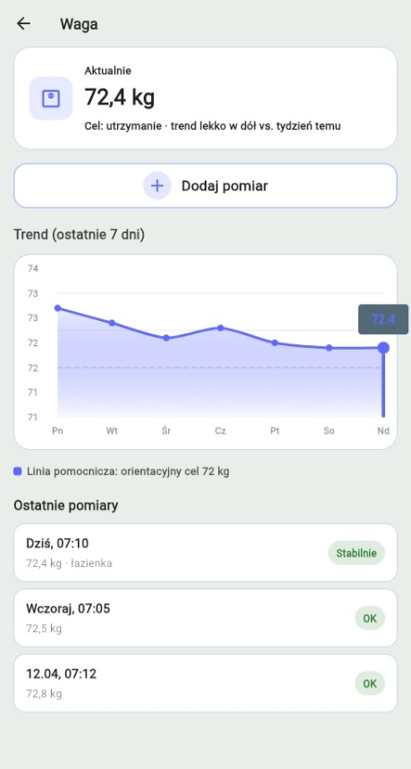

# MyBetterness

A comprehensive patient monitoring and caregiver support system designed to facilitate and manage home healthcare processes.

## About The Project

MyBetterness is a central solution supporting the daily functioning of patients, the elderly, or those suffering from illnesses. The main design challenge was to create a system that combines multiple health tracking features with an extremely simplified, legible, and easy-to-use interface.

### Key Principles:
*   **Automation:** The system automatically generates schedules and reminders based on user input.
*   **Clarity:** Utilizes large interactive elements and a clean content layout for accessibility.
*   **Collaboration:** Provides caregivers with full, real-time insight into the patient's current parameters and status.

## Screenshots

  
  &nbsp;&nbsp;&nbsp;&nbsp;
  
    
  
  &nbsp;&nbsp;&nbsp;&nbsp;
  

## Features

*   **Main Dashboard:** Acts as a control center showing the daily status (medications, appointments), latest health measurements, and quick action buttons for logging data.
*   **Vitals Monitoring:** Forms for entering numerical data (blood pressure, glucose, weight) with trend analysis and basic medical norm validation.
*   **Medication Management:** Smart push notifications for doses, medication database (form, dose, time), and intake confirmation instantly visible to the caregiver.
*   **Calendar & Appointments:** Integrated medical event scheduling (visits, rehab, meals) with daily/monthly views. Caregivers can remotely add events that trigger notifications for the patient.
*   **Location & Help Map:** OpenStreetMap integration displaying nearby pharmacies and a "Find Help" directory.
*   **Caregiver Panel:** A dedicated interface for caregivers to monitor patient stability, check medication adherence, view recent measurements, and generate PDF reports.

## Tech Stack

*   **Frontend:** [Flutter](https://flutter.dev) (Cross-platform UI for Android and iOS)
*   **Backend:** [Firebase](https://firebase.google.com/) 
    *   **Cloud Firestore:** Real-time database optimized for mobile data transfer.
    *   **Firebase Auth:** Secure user authentication.
    *   **Firebase Cloud Messaging (FCM):** Push notifications and reminders.

## Architecture & Code Structure

The project follows Object-Oriented Programming (OOP) best practices and Clean Architecture principles. It heavily utilizes asynchronous operations (`Future`/`Stream`) to ensure the UI remains responsive during network requests.

*   `lib/models/`: Data object definitions (e.g., `Event`, `Med`, `User`).
*   `lib/services/`: Firebase logic, backend communication, and external services.
*   `lib/components/`: Reusable UI widgets and elements (buttons, cards).

## Acknowledgments
*   Developed as part of a university project.
*   Map data provided by OpenStreetMap.
